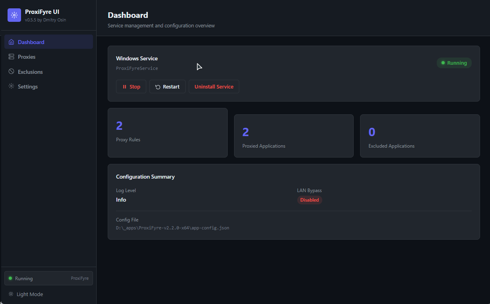
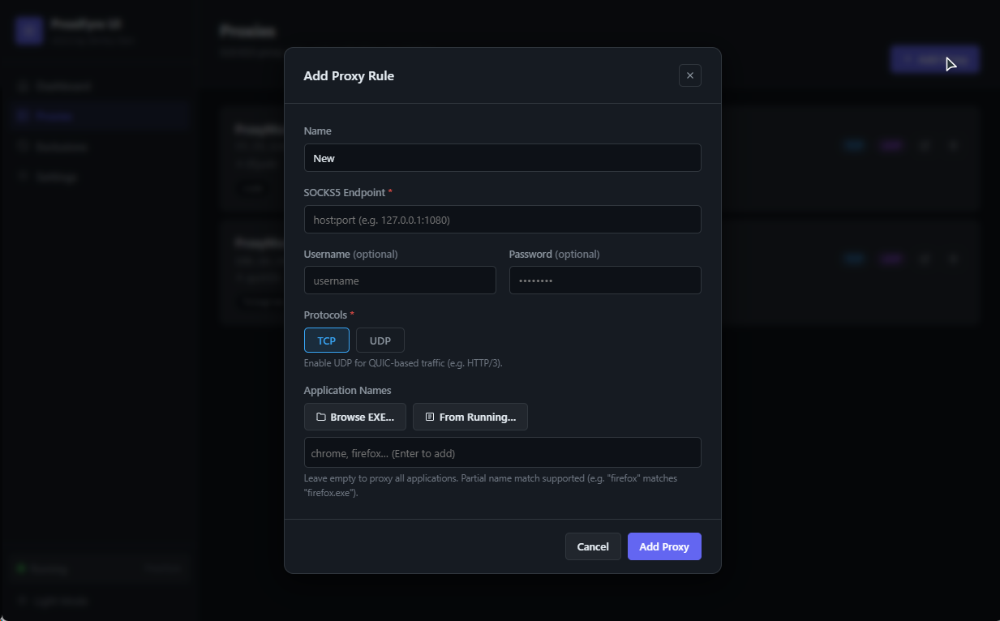
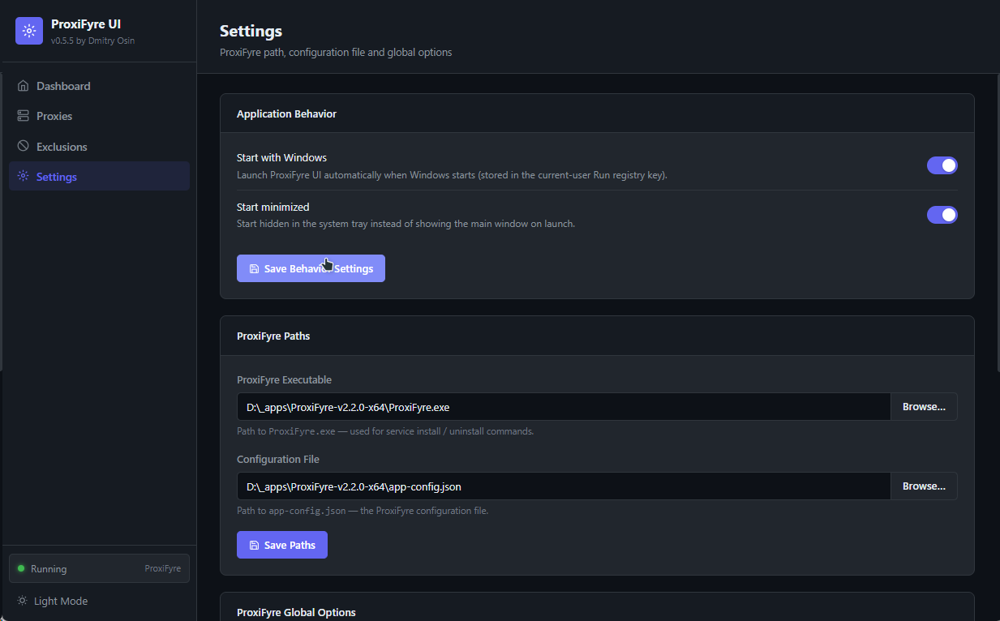

# ProxiFyre UI

A modern desktop application for managing the [ProxiFyre](https://github.com/wiresock/proxifyre) SOCKS5 proxifier —
configure proxy rules, manage application exclusions, and control the Windows service, all from a clean
dark/light-themed GUI.

> **Windows only.** ProxiFyre itself is a Windows-native proxifier; this UI targets the same platform.

---

## Screenshots

Dashboard



Add Proxy Rule Page



Settings Page



---

## Features

- **Proxy rules** — add, edit, and delete SOCKS5 proxy entries with named rules, per-app routing, TCP/UDP protocol
  selection, and optional authentication
- **Application picker** — select apps from running processes or browse for `.exe` files directly
- **Exclusions** — maintain a bypass list so chosen apps skip all proxy rules
- **Service management** — install, uninstall, start, stop, and restart the ProxiFyre Windows service
- **System tray** — minimize to tray, show/hide window, and control the service from the tray menu
- **Autostart** — optional launch with Windows via the current-user Run registry key
- **Start minimized** — optionally start hidden in the tray
- **Dark / Light theme** — persisted across sessions
- **Admin elevation** — detects non-elevated sessions and offers a one-click RunAs prompt

---

## Installation

### Step 1 — Install system dependencies

These components are required by ProxiFyre and must be installed before running the service.

| # | Component                                                                                                            | Description                                         |
|---|----------------------------------------------------------------------------------------------------------------------|-----------------------------------------------------|
| 1 | [Windows Packet Filter (WinpkFilter)](https://github.com/wiresock/ndisapi/releases)                                  | Low-level packet filtering driver used by ProxiFyre |
| 2 | [Visual C++ Redistributable](https://learn.microsoft.com/en-us/cpp/windows/latest-supported-vc-redist?view=msvc-170) | Microsoft Visual Studio Runtime Libraries (x64)     |
| 3 | [ProxiFyre](https://github.com/wiresock/proxifyre/releases)                                                          | The core SOCKS5 proxifier application               |

### Step 2 — Install ProxiFyre UI

Download the latest `.msi` or `.exe` installer from the [Releases](https://github.com/dmitry-osin/ProxiFyreUI/releases)
page and run it.

### Step 3 — Configure and start

1. Launch **ProxiFyre UI** (run as Administrator for service management)
2. Open **Settings** → **ProxiFyre Paths** and set:
    - **ProxiFyre Executable** — path to `ProxiFyre.exe`
    - **Configuration File** — path to `app-config.json` (use *Create Default Config* if the file doesn't exist yet)
3. Open **Proxies** and add one or more SOCKS5 proxy rules, assigning target applications to each rule
4. Open **Exclusions** and add any applications that should bypass all proxies
5. Return to **Dashboard** → click **Install Service**, then **Start** to bring the ProxiFyre Windows service online

> All UI settings are stored in `%APPDATA%\pro.osin.tools.proxifyre-ui\`.

---

## Tech Stack

| Layer           | Technology                                                                     |
|-----------------|--------------------------------------------------------------------------------|
| Desktop shell   | [Tauri 2](https://tauri.app)                                                   |
| Frontend        | [SvelteKit 2](https://kit.svelte.dev) + [Svelte 5](https://svelte.dev) (Runes) |
| Language        | TypeScript + Rust                                                              |
| Bundler         | Vite                                                                           |
| Package manager | pnpm                                                                           |
| Installers      | NSIS · MSI (Windows)                                                           |

---

## Building from Source

### Prerequisites

- [Rust](https://rustup.rs) (stable, `x86_64-pc-windows-msvc` target)
- [Node.js](https://nodejs.org) ≥ 20
- [pnpm](https://pnpm.io) ≥ 9
- [Tauri prerequisites](https://tauri.app/start/prerequisites/) for Windows (Visual Studio Build Tools / MSVC)

### Development

```powershell
pnpm install
pnpm tauri dev
```

### Production build

```powershell
pnpm tauri build
```

Installers are written to `src-tauri/target/release/bundle/`.

### Icon generation

If you replace `src-tauri/icons/icon.png` (minimum **1024 × 1024 px**), regenerate all required icon formats with:

```powershell
pnpm tauri icon src-tauri/icons/icon.png
```

---

## CI / CD

GitHub Actions workflow (`.github/workflows/release.yml`):

- **`check-build`** — runs `cargo check` + `svelte-check` + frontend build on every push/PR to `main`
- **`build-windows`** — triggered on `v*.*.*` tags; builds NSIS + MSI installers and publishes a GitHub Release

---

## License

MIT © 2025 [Dmitry Osin](mailto:d@osin.pro)
